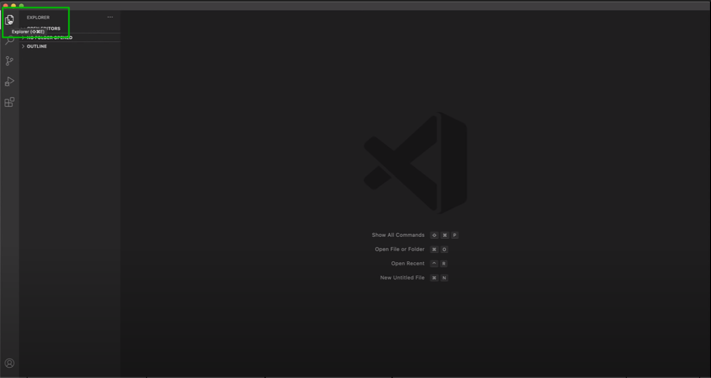
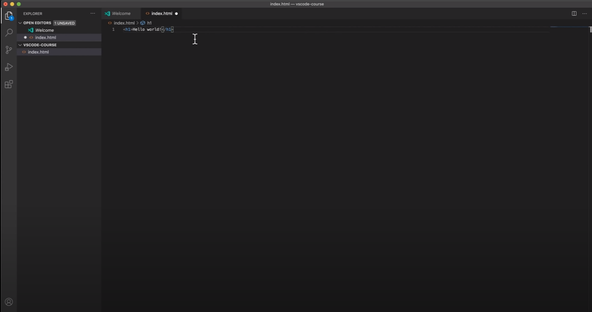
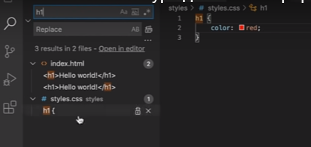
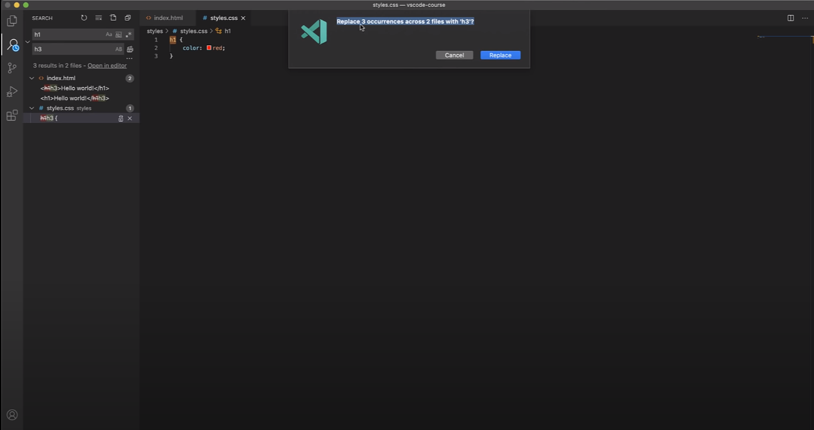
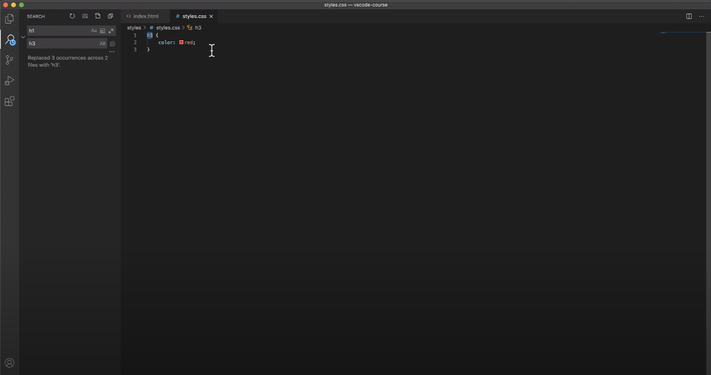
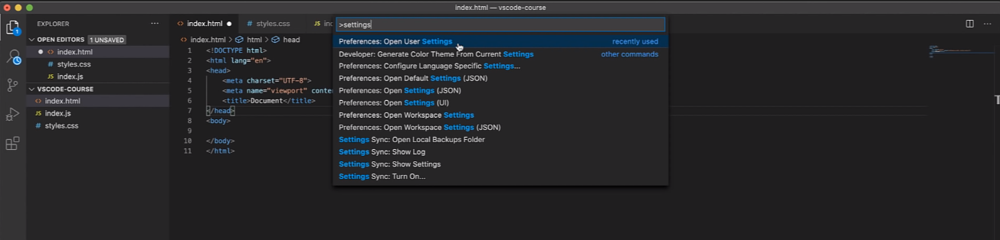
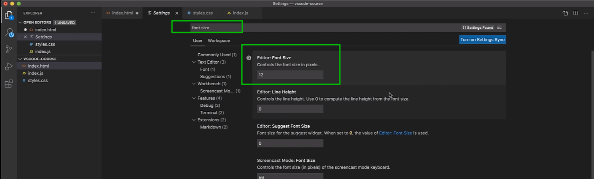
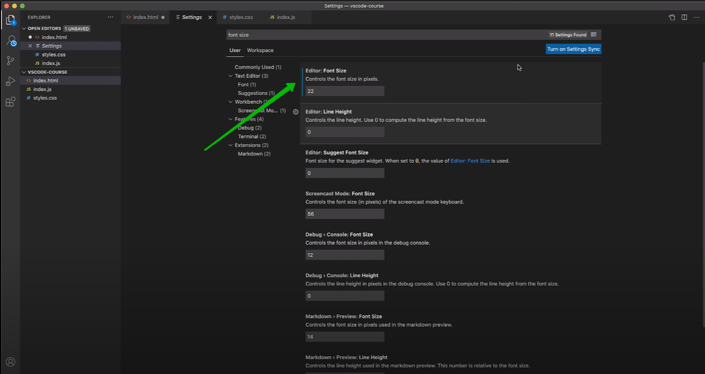
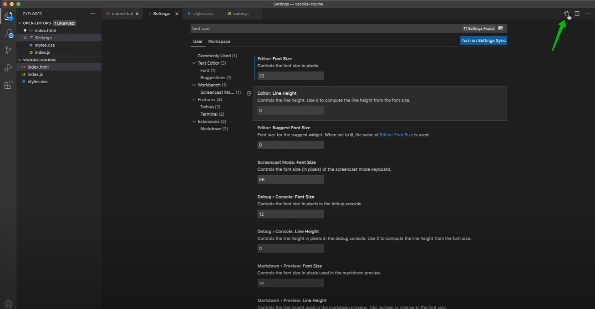
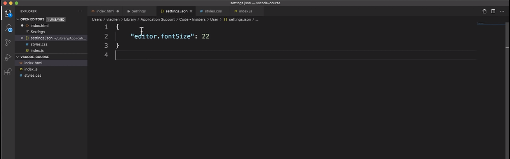

# VS Code

[VS Code Скачивай тут](https://code.visualstudio.com/)

Интерфейс

explorer я могу вызывать сочетанием клавиш Shift + Ctl + E.

Вообще чем меньше мы работаем с мышкой при кодинге тем быстрее мыв общем-то разрабатываем. По этому имеет смысл запоминать эти все комбинации для того что бы вы максимально могли сосредоточится на написании кода.

Открыть какой то проект Ctr + O где я могу выбрать папку с которой я буду работать.

Если мы пишем код и вот здесь горит кружок то это обозначает что есть какие-то не сохраненные изменения.

Создание папок и файлов это я и так уже знаю пропускаю.

Кнопка поиска это сделано для того что бы мы могли глобально что-то искать по проекту. Ну например я хочу найти все заголовки h1

Так же есть опция с помощью которой мы можем заменить то что мы нашли.

И вот во всем проекте мы заменили то что нашли.

Создание файла Ctl + N.

По умолчанию в VS Code встроена такая система как Intellisense. Вы наверняка слышали про такую систему которая называется Emmet. Cуть сводится к тому что мы можем довольно быстро писать html. Я могу написать h1 и нажать Tab он вставит готовый тег. При введении ! я могу вставить стартовый шаблон html.

И так увеличу шрифт. Нажимаю Ctrl + Shift + P открывается основное меню куда я могу вписывать интересующие меня и например settings 

Синяя полоска указывает на то что изменения были применены.

Кстати мы можем посмотреть все кастомные пользовательские настройки нажав на иконку 

Здесь описаны те настройки которые мы сами задавали для VS Code.

Теперь возвращаемся к Intellisense. Изучи [Emmet](https://emmet.io/).
