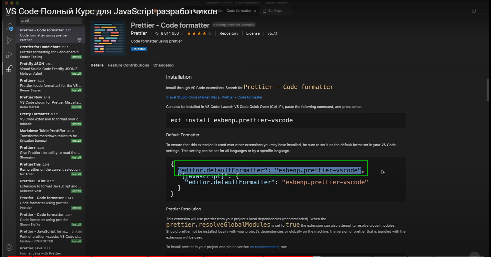
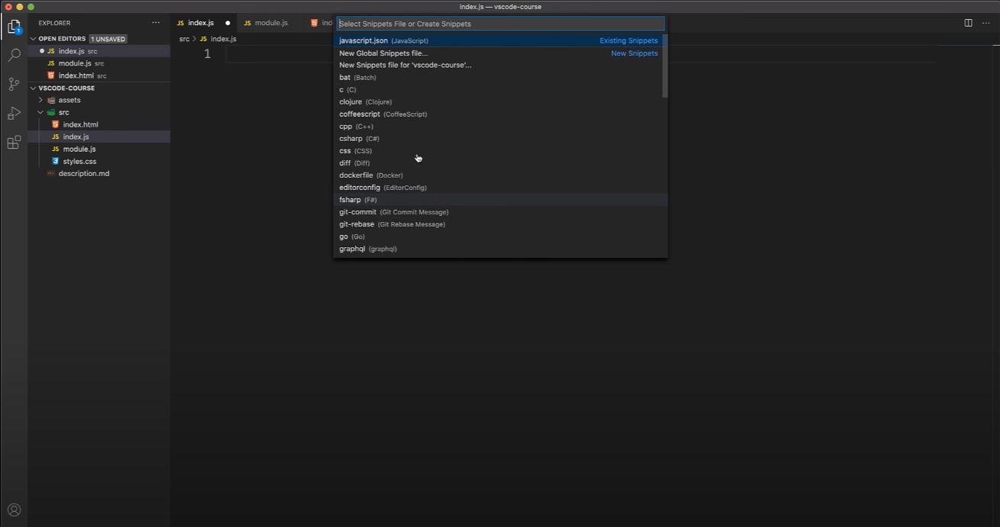

# VS Code

[VS Code Скачивай тут](https://code.visualstudio.com/)

Интерфейс

**explorer** я могу вызывать сочетанием клавиш **Shift + Ctl + E**.

Вообще чем меньше мы работаем с мышкой при кодинге тем быстрее мыв общем-то разрабатываем. По этому имеет смысл запоминать эти все комбинации для того что бы вы максимально могли сосредоточится на написании кода.

Открыть какой то проект **Ctr + O** где я могу выбрать папку с которой я буду работать.

Если мы пишем код и вот здесь горит кружок то это обозначает что есть какие-то не сохраненные изменения.

Создание папок и файлов это я и так уже знаю пропускаю.

Кнопка поиска это сделано для того что бы мы могли глобально что-то искать по проекту. Ну например я хочу найти все заголовки **h1**

Так же есть опция с помощью которой мы можем заменить то что мы нашли.

И вот во всем проекте мы заменили то что нашли.

Создание файла **Ctl + N**.

По умолчанию в **VS Code** встроена такая система как **Intellisense**. Вы наверняка слышали про такую систему которая называется **Emmet**. Cуть сводится к тому что мы можем довольно быстро писать **html**. Я могу написать **h1** и нажать **Tab** он вставит готовый тег. При введении **!** я могу вставить стартовый шаблон **html**.

И так увеличу шрифт. Нажимаю **Ctrl + Shift + P** открывается основное меню куда я могу вписывать интересующие меня и например **settings**

Синяя полоска указывает на то что изменения были применены.

Кстати мы можем посмотреть все кастомные пользовательские настройки нажав на иконку

Здесь описаны те настройки которые мы сами задавали для **VS Code**.

Теперь возвращаемся к **Intellisense**. Изучи [Emmet](https://emmet.io/).

Более детально про настройки.

Рассмотрим вот это интересное свойство.

По умолчанию эта опция выключена. Посмотрим что это вообще обозначает. В **HTML** есть такая команда которая называется **lorem**

Это так называемый генератор текста. С помощью этой команды и какого-то числа

могу добавлять текст.

Однако если мы включим настройку **Word Wrap**. То линии будут переносится на новую строчку по ширине экрана.

Это очень удобно так как нет горизонтального скрола. Так же там можно настроить количество символов.

Если добавить например папку **.git**. Мы можем сделать так что бы она не показывалась в нашем проекте.

Ну или к примеру **module.js** который если я добавлю не будет показываться в проекте.

Рассмотрим переход по файлам. Для этого нажать **Ctrl + Tab**

Закрыть не интересующую вкладку **Ctrl + W**.

К примеру если я хочу открыть какой - то файл я могу **Ctrl + F** и ввести название файла.

Для того что бы переключаться по открытым файлам **Ctrl + P**.

Это **MiniMap** с помощью которого можно быстро перемещаться по файлу.

Далее в низу мы можем найти такое поле которое называется **outline**

В нем мы можем посмотреть какие есть вообще сущности, классы и где они определены, мы можем к ним переходить. Если бы у нас здесь была бы иерархия классов, то мы так же здесь увидили бы информацию. Это пришло из **Java**, там это более очевидно но тем не менее так же перекочевало в **JS**.

Теперь поговорим про кнопку настроек.

Рассмотрим **Keyboard Shortcuts**.

Мы можем сами задавать какие - то команды для того что бы нам было комфортно разрабатывать.

Если вы когда-то работали в другом редакторе и некоторые плюшки вам там нравились, то мы можем рассмотреть **Keymaps**.

И мы попадаем в **Extentions** на самом деле.

И мы видим какие **keymap** вообще по умолчанию есть в **VS Code**.

 
 
 

---

## Extentions

Полный список смотри в **pdf** в телеграмм канале.

1. **vscode-icons** [https://marketplace.visualstudio.com/items?itemName=vscode-icons-team.vscode-icons](https://marketplace.visualstudio.com/items?itemName=vscode-icons-team.vscode-icons)
2. Material theme [https://marketplace.visualstudio.com/items?itemName=Equinusocio.vsc-material-theme](https://marketplace.visualstudio.com/items?itemName=Equinusocio.vsc-material-theme)

Все темы моэно посмотреть в **install Additional Color Themes**

Мы попадаем в **Market Place** c фильтром категории темы.

3. **Bracket Pair Colorizer 2** [https://marketplace.visualstudio.com/items?itemName=CoenraadS.bracket-pair-colorizer-2](https://marketplace.visualstudio.com/items?itemName=CoenraadS.bracket-pair-colorizer-2)

4. Далее есть некоторая проблематика в vs code допустим я хочу поменять h1 на h2 Для того что бы это проходило удобно ставлю **auto rename teg** [https://marketplace.visualstudio.com/items?itemName=formulahendry.auto-rename-tag](https://marketplace.visualstudio.com/items?itemName=formulahendry.auto-rename-tag)
5. Так же **auto close teg** [https://marketplace.visualstudio.com/items?itemName=formulahendry.auto-close-tag](https://marketplace.visualstudio.com/items?itemName=formulahendry.auto-close-tag)
6. **Prettier-Code formater** [https://marketplace.visualstudio.com/items?itemName=esbenp.prettier-vscode](https://marketplace.visualstudio.com/items?itemName=esbenp.prettier-vscode). Но его необходимо чуть настроить. Заходим в settings и ищем такую настройку ка format on save.

И Ставлю галочку в **format on save** тем самым мы говорим что мы хотим созранять файл при форматировании. И далее я должен добавить его по умолчанию. Для этого я копирую вот эту строчку.

Теперь посмотри вниз редактора, в правом нижнем углу появляется надпись **prittier**.

При нажатии **Ctrl + S** он форматирует и сохраняет файл.

Так же я могу перейти в настройки самого расширения и менять все то что мне нужно.

**Prettier: Single Quote** рекомендую использовать одинарные кавычки. Ставлю галочку.
**Prettier: Tab With ставлю 2**.

7. **LiveServer** [https://marketplace.visualstudio.com/items?itemName=ritwickdey.LiveServer](https://marketplace.visualstudio.com/items?itemName=ritwickdey.LiveServer)
8. EditorConfig [https://marketplace.visualstudio.com/items?itemName=EditorConfig.EditorConfig](https://marketplace.visualstudio.com/items?itemName=EditorConfig.EditorConfig). Это грубо говоря небольшой файлик котороый синхранизирует настройки между разними редакторами, операционными системами под ваш проект. Это просто отдельный файл с расширением **.editorconfig** в корне проекта. Соответсвенно этот **extantion** помогает их подцепить и построить настройки вашего проекта автоматически.
9. **css peek** [https://marketplace.visualstudio.com/items?itemName=pranaygp.vscode-css-peek](https://marketplace.visualstudio.com/items?itemName=pranaygp.vscode-css-peek)

10. **Import Cost** [https://marketplace.visualstudio.com/items?itemName=wix.vscode-import-cost](https://marketplace.visualstudio.com/items?itemName=wix.vscode-import-cost). Он показывает размер импортируемого файла.

11. Потрясающая настрока **Settings Sync** [https://marketplace.visualstudio.com/items?itemName=Shan.code-settings-sync](https://marketplace.visualstudio.com/items?itemName=Shan.code-settings-sync). Перехожу в **Settings** И здесь есть **Turn on settings Sync**.

Дибо мы можем войти в профиль где тоже есть такая кнопка. Нажимаю на нее, далее нажимаю на **turne on** и далее мы выбираем что мы хотим засинхронизировать.

Я выбираю все и нажимаю **Sing in & Turn on**. Далее выбираю версию редактора, если из несколько. Иначе перебрасывает где дается с помощью чего это дается засинхронизировать. Естественно с помощью **Git**. Далее генерируется определенный токет. И далее кликаю открыть с помощью **VS Code**. Все настройки синхронезированы.

И теперь если я захочу перенести данные настройки на другой компьютер то я просто захожу на свой акаунт **GitHub** откуда потом подтягиваются все рассширения.

 
 
 

## Snippets

Далее мы выбираем для какого типа файлов мы хотим эти сниппеты создать.

Перехожу в **JavaScript** и по сути здесь есть хороший пример как эти сниппеты добавляются.

Мы работаем в **JSON** в нем я определяю объект к примеру **"Console log with massege":{}** где по сути мне нужно определить несколько свойств. Первое свойство это **"prefix": ""** т.е. та команда которая будет вызывать нашу полную команду, тот код который мы в итоге хотим получить. Далее передаю **"body": ""** это то что сгенерирует сниппет. Так же необходимо добавить **"description": ""**.

Если хочу что бы при нажатии на **tab** курсор перенаправлялся в начало или в конец строчки то дописываю **\$0**.

Так же можно использовать переменные

При кодинге когда будем именовать переменную автоматически подставляется ее поиск по **id** из **DOM**.

Важный момент **body** может быть как массив.

И вот генерация.

 
 
 

## Debug

Посмотрим как можно дебажить вот эту функцию.

И я попадаю в **debug** инструмент.

## git

Мы можем посмотреть на изменения.

Еще куча плюшек.
